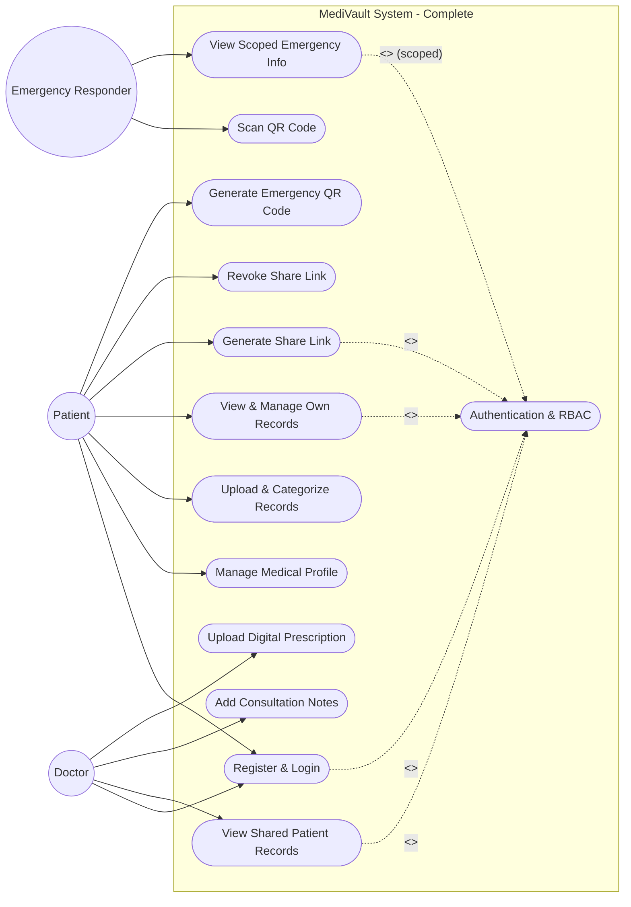
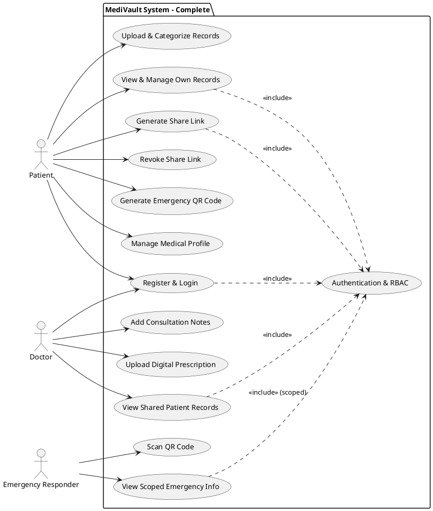

# MediVault Full Project Use Case Diagram

This is the complete Use Case Diagram for the MediVault project. It includes all features from both the first half (basic upload/login) and the advanced second half (Emergency Access, Secure Sharing, Prescriptions). It is 100% aligned with the modules in the `README.md`.

## Live Rendered Diagram (Mermaid)

---

## PlantUML Source Code (For Image Generation)

## How to add the final image
When you generate the `.png` image of this full diagram, you can embed it into this file by adding the following line at the top:
``